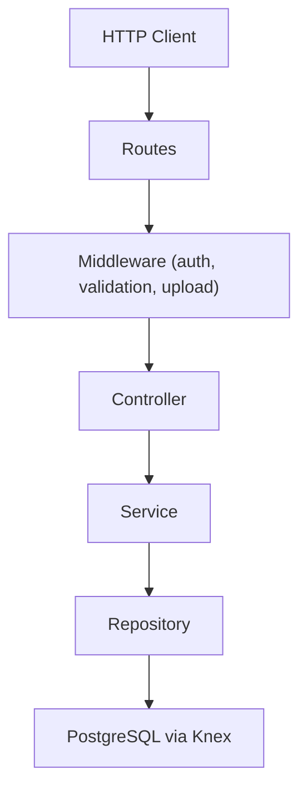
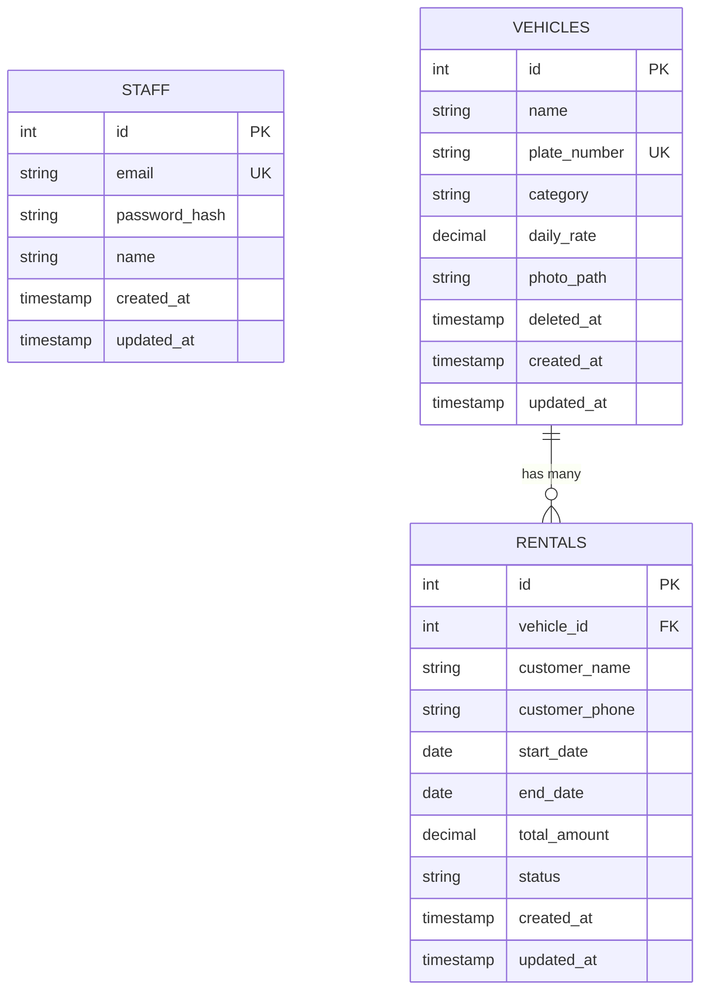

# Vehicle Rental Management Backend

Backend REST API for a vehicle rental management system.

## 1. Tech Stack & Architecture

### Languages & Frameworks

| Layer | Technology | Version (from `package.json`) |
|---|---|---|
| Language | TypeScript | `^6.0.3` |
| Runtime | Node.js | — (no `.nvmrc`; inferred ≥ 20) |
| Web framework | **Express 5** | `^5.2.1` |
| Database | **PostgreSQL** | via `pg ^8.23.0` |
| Query builder / migrations | **Knex.js** | `^3.3.0` |
| Validation | **Joi** | `^18.2.3` |
| Auth | **jsonwebtoken** (JWT) | `^9.0.3` |
| Password hashing | **bcryptjs** | `^3.0.3` |
| File uploads | **Multer** | `^2.2.0` |
| Security headers | **Helmet** | `^8.3.0` |
| API docs | **swagger-jsdoc + swagger-ui-express** | `^6.3.0` / `^5.0.1` |
| Dev runner | **tsx** (watch mode) | `^4.23.12` |
| Linting | ESLint + typescript-eslint + Prettier | various |

### Architecture Pattern

**Layered monolith** following a classic **Controller → Service → Repository** separation:



There is **one single process** — an Express HTTP server. No workers, schedulers, message queues, or microservices.

### Folder Structure

```
Vehicle-Rental-Management/
├── src/
│   ├── server.ts              ← Entry point: starts HTTP listener
│   ├── app.ts                 ← Express app assembly (middleware, routes, Swagger)
│   ├── config/                ← Environment, DB, JWT, Swagger configuration
│   ├── controllers/           ← Request handlers (thin: delegate to services)
│   ├── services/              ← Business logic layer
│   ├── repositories/          ← Database access (Knex queries)
│   ├── routes/                ← Express Router definitions + Swagger JSDoc
│   ├── middleware/            ← auth, validation, error handling, file upload
│   ├── validators/            ← Joi schemas for request validation
│   ├── types/                 ← TypeScript interfaces & Express.d.ts augmentation
│   ├── utils/                 ← Helpers (JWT, bcrypt, date calc, AppError)
│   └── database/
│       ├── migrations/        ← Knex migration files (3 tables)
│       └── seeds/             ← Seed data for dev/testing
├── knexfile.ts                ← Knex CLI configuration (points at src/config/env)
├── .env                       ← Environment variables (committed — see §8)
├── uploads/                   ← File upload destination (empty, .gitignored)
├── dist/                      ← Compiled JS output (.gitignored)
├── package.json
├── tsconfig.json
├── eslint.config.mjs
└── .prettierrc
```

---

## 2. Entry Points & Execution Flow

### Startup Sequence

**Entry file:** [server.ts](file:///c:/Users/maeed/OneDrive/Documents/Projects/Vehicle-Rental-Management/src/server.ts)

```
1.  dotenv/config loads .env → process.env populated
2.  import app.ts triggers:
    a.  config/env.ts validates required DB env vars (throws if missing)
    b.  config/database.ts creates the Knex connection pool
    c.  All route modules instantiate their Repository → Service → Controller chains
    d.  Middleware is registered: body-parser, helmet, json
    e.  Routes mounted at /auth, /vehicles, /rentals, /reports
    f.  Swagger UI mounted at /api-docs
    g.  Health check at GET /health
    h.  notFoundMiddleware + errorMiddleware registered last
3.  app.listen(PORT) starts the HTTP server (default port 5000)
```

### Available Processes

There is **only one process**: the Express API server.

| npm script | What it does |
|---|---|
| `npm run dev` | Runs [server.ts](file:///c:/Users/maeed/OneDrive/Documents/Projects/Vehicle-Rental-Management/src/server.ts) with `tsx watch` (hot-reload) |
| `npm run build` | Compiles TypeScript → `dist/` |
| `npm start` | Runs compiled `dist/server.js` with Node |
| `npm run db:test` | Runs [database-test.ts](file:///c:/Users/maeed/OneDrive/Documents/Projects/Vehicle-Rental-Management/src/config/database-test.ts) — tests Postgres connectivity |
| `npm run migrate` | Runs Knex migrations |
| `npm run seed` | Seeds the database with sample data |

---

## 3. Business Logic & Core Functionality

### Core Purpose

This is a **backend REST API for a vehicle rental business**. Staff members (not customers directly) log in and manage a fleet of vehicles and their rental bookings. The system tracks which vehicles are rented to which customers, for which dates, at what rate, and generates monthly revenue reports.

### Domain Entities



### Key Workflows

#### Workflow 1: Staff Authentication

1. Staff POSTs `{ email, password }` to `/auth/login`
2. [AuthService.login()](file:///c:/Users/maeed/OneDrive/Documents/Projects/Vehicle-Rental-Management/src/services/auth.service.ts#L12-L37) looks up staff by email via [StaffRepository](file:///c:/Users/maeed/OneDrive/Documents/Projects/Vehicle-Rental-Management/src/repositories/staff.repository.ts)
3. Bcrypt compares the password against the stored hash
4. On success, a JWT is generated with payload `{ sub: staffId, email, name }` and returned
5. All subsequent requests require `Authorization: Bearer <token>` — enforced by [authMiddleware](file:///c:/Users/maeed/OneDrive/Documents/Projects/Vehicle-Rental-Management/src/middleware/auth.middleware.ts#L23-L84)

#### Workflow 2: Vehicle CRUD

All vehicle endpoints require authentication.

| Operation | Endpoint | Key Logic |
|---|---|---|
| **List** | `GET /vehicles?page=&limit=&category=&search=` | Paginated, filterable by category, searchable by name (ILIKE). Soft-deleted vehicles are excluded. |
| **Get by ID** | `GET /vehicles/:id` | Returns single vehicle, excludes soft-deleted |
| **Create** | `POST /vehicles` (multipart/form-data) | Accepts photo upload (JPEG/PNG/WebP, max 5MB). Validated via Joi. |
| **Update** | `PUT /vehicles/:id` (multipart/form-data) | Partial update. Optionally replaces photo. |
| **Delete** | `DELETE /vehicles/:id` | **Soft-delete** only — sets `deleted_at` timestamp |

- Photo handling: [upload.middleware.ts](file:///c:/Users/maeed/OneDrive/Documents/Projects/Vehicle-Rental-Management/src/middleware/upload.middleware.ts) uses Multer disk storage, generates UUID filenames, filters MIME types.
- The repository [vehicle.repository.ts](file:///c:/Users/maeed/OneDrive/Documents/Projects/Vehicle-Rental-Management/src/repositories/vehicle.repository.ts) maps snake_case DB rows to camelCase domain objects via `mapRowToVehicle()`.

#### Workflow 3: Rental Management

The core booking workflow in [rental.service.ts](file:///c:/Users/maeed/OneDrive/Documents/Projects/Vehicle-Rental-Management/src/services/rental.service.ts):

**Creating a rental (`POST /rentals`):**

1. Validate `endDate >= startDate`
2. **Inside a DB transaction:**
   - Look up the vehicle's `daily_rate` (ensure vehicle exists and isn't deleted)
   - Check for **overlapping active rentals** (status = `booked` or `ongoing`) on the same vehicle for the requested date range
   - If conflict → `409 Conflict`
   - Calculate `totalAmount = dailyRate × rentalDays` (inclusive day count via [calculateRentalDays](file:///c:/Users/maeed/OneDrive/Documents/Projects/Vehicle-Rental-Management/src/utils/date.ts))
   - Insert rental with status `booked`

**Updating a rental (`PUT /rentals/:id`):**

1. Fetch existing rental inside a transaction
2. Merge provided fields with existing values
3. Re-validate vehicle existence, re-check for conflicts (excluding self), recalculate `totalAmount`
4. Supports status transitions (e.g., `booked` → `ongoing` → `completed`)

**Cancelling a rental (`DELETE /rentals/:id`):**

- Sets the rental's status to `cancelled` (does not hard-delete the record)

**Rental statuses:** `booked` → `ongoing` → `completed` (or `cancelled` at any point). Enforced via a CHECK constraint in the DB.

#### Workflow 4: Monthly Revenue Reporting

`GET /reports/rentals?month=2026-08&vehicle_id=5`

[ReportService](file:///c:/Users/maeed/OneDrive/Documents/Projects/Vehicle-Rental-Management/src/services/report.service.ts) calls a [raw SQL query](file:///c:/Users/maeed/OneDrive/Documents/Projects/Vehicle-Rental-Management/src/repositories/rental.repository.ts#L248-L339) that:

- Uses a CTE (`report_period`) to derive month start/end from `YYYY-MM` input
- LEFT JOINs vehicles with active/completed rentals overlapping the target month
- Calculates **days rented** (clamped to the month boundary) and **revenue** per vehicle
- Optionally filters by a specific `vehicle_id`
- Returns all vehicles sorted by revenue descending
- The service layer identifies the **highest revenue vehicle** in the result set

---

## 4. Data & Storage

### Database

**PostgreSQL** (single database: `vehicle_rental_db` by default).

### Schema (3 Tables)

Created via Knex migrations in order:

#### `staff` — [migration](file:///c:/Users/maeed/OneDrive/Documents/Projects/Vehicle-Rental-Management/src/database/migrations/20260811115443_create_staff_table.ts)

| Column | Type | Constraints |
|---|---|---|
| `id` | serial (PK) | auto-increment |
| `email` | varchar(255) | NOT NULL, UNIQUE |
| `password_hash` | varchar(255) | NOT NULL |
| `name` | varchar(150) | NOT NULL |
| `created_at` | timestamptz | NOT NULL, default now() |
| `updated_at` | timestamptz | NOT NULL, default now() |

#### `vehicles` — [migration](file:///c:/Users/maeed/OneDrive/Documents/Projects/Vehicle-Rental-Management/src/database/migrations/20260811121105_create_vehicles_table.ts)

| Column | Type | Constraints |
|---|---|---|
| `id` | serial (PK) | auto-increment |
| `name` | varchar(150) | NOT NULL |
| `plate_number` | varchar(50) | NOT NULL, UNIQUE |
| `category` | varchar(100) | NOT NULL |
| `daily_rate` | decimal(10,2) | NOT NULL |
| `photo_path` | varchar(500) | NULLABLE |
| `deleted_at` | timestamptz | NULLABLE (soft-delete marker) |
| `created_at` | timestamptz | NOT NULL, default now() |
| `updated_at` | timestamptz | NOT NULL, default now() |

#### `rentals` — [migration](file:///c:/Users/maeed/OneDrive/Documents/Projects/Vehicle-Rental-Management/src/database/migrations/20260811122355_create_rentals_table.ts)

| Column | Type | Constraints |
|---|---|---|
| `id` | serial (PK) | auto-increment |
| `vehicle_id` | integer (FK → vehicles.id) | NOT NULL, ON DELETE RESTRICT |
| `customer_name` | varchar(150) | NOT NULL |
| `customer_phone` | varchar(30) | NOT NULL |
| `start_date` | date | NOT NULL |
| `end_date` | date | NOT NULL |
| `total_amount` | decimal(12,2) | NOT NULL |
| `status` | varchar(20) | NOT NULL, default `'booked'`, CHECK IN (`booked`, `ongoing`, `completed`, `cancelled`) |
| `created_at` | timestamptz | NOT NULL, default now() |
| `updated_at` | timestamptz | NOT NULL, default now() |

**Indexes on `rentals`:** `vehicle_id`, `status`, `start_date`, `end_date`

### Data Validation

- **Request-level:** [Joi schemas](file:///c:/Users/maeed/OneDrive/Documents/Projects/Vehicle-Rental-Management/src/validators) validate all incoming data. The [validate middleware](file:///c:/Users/maeed/OneDrive/Documents/Projects/Vehicle-Rental-Management/src/middleware/validation.middleware.ts) runs `schema.validate()` with `abortEarly: false` and `stripUnknown: true`, storing validated data in `res.locals.validated`.
- **Database-level:** CHECK constraint on rental status, UNIQUE on plate_number, FK constraint on vehicle_id, NOT NULL on required columns.

### Seed Data — [seeds/](file:///c:/Users/maeed/OneDrive/Documents/Projects/Vehicle-Rental-Management/src/database/seeds)

| File | Contents |
|---|---|
| [01_staff.ts](file:///c:/Users/maeed/OneDrive/Documents/Projects/Vehicle-Rental-Management/src/database/seeds/01_staff.ts) | Creates admin staff: `admin@vehiclerental.com` / `Admin@123` |
| [02_vehicles.ts](file:///c:/Users/maeed/OneDrive/Documents/Projects/Vehicle-Rental-Management/src/database/seeds/02_vehicles.ts) | 4 vehicles (Toyota Corolla, Toyota RAV4, Honda Civic, Nissan X-Trail) with Dhaka plates |
| [03_rentals.ts](file:///c:/Users/maeed/OneDrive/Documents/Projects/Vehicle-Rental-Management/src/database/seeds/03_rentals.ts) | 5 sample rentals covering all 4 statuses |

---

## 5. External Integrations

### Third-Party Services

**None.** This is a fully self-contained API. No external APIs, email services, notification systems, or automation tools are integrated.

### Authentication / Authorization

- **JWT-based** authentication for staff members
- **No role-based access control (RBAC)** — any authenticated staff member can perform any operation
- JWT payload contains: `{ sub: staffId, email, name }`
- Token expiry is configurable via `JWT_EXPIRES_IN` (default: `1h`)
- The [authMiddleware](file:///c:/Users/maeed/OneDrive/Documents/Projects/Vehicle-Rental-Management/src/middleware/auth.middleware.ts) verifies the token, validates the payload structure, and attaches the decoded user to `req.user`

### API Documentation

- **Swagger UI** served at `/api-docs`
- Defined programmatically in [swagger.ts](file:///c:/Users/maeed/OneDrive/Documents/Projects/Vehicle-Rental-Management/src/config/swagger.ts) with schemas for all request/response models
- Route-level documentation via `@swagger` JSDoc annotations in route files

---

## 6. Configuration & Environment

### Environment Variables

Defined in [.env](file:///c:/Users/maeed/OneDrive/Documents/Projects/Vehicle-Rental-Management/.env) and validated by [config/env.ts](file:///c:/Users/maeed/OneDrive/Documents/Projects/Vehicle-Rental-Management/src/config/env.ts):

| Variable | Required | Default | Purpose |
|---|---|---|---|
| `NODE_ENV` | No | `development` | Runtime environment |
| `PORT` | No | `5000` | HTTP server port |
| `DB_HOST` | **Yes** | — | PostgreSQL host |
| `DB_PORT` | **Yes** | `5432` | PostgreSQL port |
| `DB_NAME` | **Yes** | — | Database name |
| `DB_USER` | **Yes** | — | Database user |
| `DB_PASSWORD` | **Yes** | — | Database password |
| `DB_POOL_MIN` | No | `2` | Min connection pool size |
| `DB_POOL_MAX` | No | `10` | Max connection pool size |
| `JWT_SECRET` | No (but should be) | `''` | Secret key for signing JWTs |
| `JWT_EXPIRES_IN` | No | `''` | Token expiry (e.g., `1h`, `7d`) |
| `UPLOAD_PATH` | No | `uploads` | Directory for uploaded photos |

> [!IMPORTANT]
> `JWT_SECRET` and `JWT_EXPIRES_IN` are **not** in the required-variable check in `env.ts`, but they are functionally essential. The app will start with empty strings for these, which would make JWT signing/verification broken or insecure.

### Config Files

| File | Purpose |
|---|---|
| [tsconfig.json](file:///c:/Users/maeed/OneDrive/Documents/Projects/Vehicle-Rental-Management/tsconfig.json) | Strict TypeScript config, ES2022 target, Node16 module resolution |
| [knexfile.ts](file:///c:/Users/maeed/OneDrive/Documents/Projects/Vehicle-Rental-Management/knexfile.ts) | Knex CLI config (development only), points to `src/database/migrations` and `src/database/seeds` |
| [eslint.config.mjs](file:///c:/Users/maeed/OneDrive/Documents/Projects/Vehicle-Rental-Management/eslint.config.mjs) | Flat config ESLint with TypeScript + Prettier |
| [.prettierrc](file:///c:/Users/maeed/OneDrive/Documents/Projects/Vehicle-Rental-Management/.prettierrc) | Semi, single quotes, trailing commas, 100 char width |

---

## 7. How to Run Locally

### Prerequisites

- **Node.js** ≥ 20 (TypeScript 6 + Express 5 require modern Node)
- **PostgreSQL** running locally (or accessible remotely)

### Step-by-Step

```bash
# 1. Clone the repo
git clone https://github.com/maeedanim/Vehicle-Rental-Management.git
cd Vehicle-Rental-Management

# 2. Install dependencies
npm install

# 3. Create the PostgreSQL database
psql -U postgres -c "CREATE DATABASE vehicle_rental_db;"

# 4. Configure environment
# Edit .env (already present) — update DB_PASSWORD, JWT_SECRET, etc.
# The defaults expect: host=127.0.0.1, port=5432, user=postgres, password=admin

# 5. Test database connectivity
npm run db:test

# 6. Run migrations to create tables
npm run migrate

# 7. Seed sample data
npm run seed

# 8. Start the dev server (hot-reload)
npm run dev
```

### After Startup

| URL | Purpose |
|---|---|
| `http://localhost:5000/health` | Health check |
| `http://localhost:5000/api-docs` | Swagger UI (interactive API explorer) |
| `http://localhost:5000/auth/login` | POST with `{"email":"admin@vehiclerental.com","password":"Admin@123"}` |

### Quick Test

```bash
# Login and get a token
curl -X POST http://localhost:5000/auth/login \
  -H "Content-Type: application/json" \
  -d '{"email":"admin@vehiclerental.com","password":"Admin@123"}'

# Use the returned accessToken for subsequent requests
curl http://localhost:5000/vehicles \
  -H "Authorization: Bearer <your-token>"
```

---

## 8. Notable Patterns

### ✅ Good Patterns

- **Clean layered architecture** — Controller → Service → Repository with proper separation of concerns
- **Database transactions** for rental creation/updates to prevent race conditions on overlapping bookings
- **Soft-delete** for vehicles (preserving rental history integrity)
- **Comprehensive Swagger documentation** with JSDoc annotations on all routes
- **Joi validation** with `stripUnknown: true` prevents mass-assignment attacks
- **Custom error types** (`RentalConflictError`, `RentalNotFoundError`, `VehicleNotFoundError`) for domain-specific error handling
- **Multer file filtering** with MIME-type whitelist and 5MB limit
- **DB indexes** on rental query patterns (`vehicle_id`, `status`, `start_date`, `end_date`)
- **upsert seed strategy** for vehicles (`onConflict('plate_number').merge(...)`) — idempotent re-runs

## 9. Architecture & Technology Decisions

This project follows a layered OOP architecture to keep routing, business logic, database access, and infrastructure concerns separated.

Architecture

```text
Client
  ↓
Express Routes
  ↓
Middleware
  ├── JWT Authentication
  ├── Joi Validation
  └── Multer File Upload
  ↓
Controllers
  ↓
Services
  ↓
Repositories
  ↓
Knex
  ↓
PostgreSQL
```

Routes define API endpoints and middleware flow.

Middleware handles authentication, validation, uploads, error handling, and request processing.

Controllers handle HTTP requests/responses and delegate business operations.

Services contain the application's business logic, such as rental availability and server-side price calculation.

Repositories isolate database queries from the business layer.

PostgreSQL stores staff, vehicles, and rental data.


Technology Decisions

### Technology	Why it was used

#### Node.js	- Provides a lightweight runtime suitable for building REST APIs.
#### TypeScript - Adds static typing, improving reliability and maintainability.
#### Express.js - Simple and flexible HTTP framework for building REST APIs.
#### PostgreSQL - Relational database suited to structured vehicle/rental data and foreign-key relationships.
#### Knex.js - Provides migrations, seeds, transactions, and SQL query building while keeping SQL accessible.
#### Joi - Validates request bodies, query parameters, and route parameters before business logic executes.
#### JWT - Provides stateless authentication for protected API endpoints.
#### bcryptjs - Securely hashes staff passwords rather than storing plaintext passwords.
#### Multer - Handles multipart form-data and local vehicle photo uploads.
#### Helmet - Adds common HTTP security headers to the Express application.
#### Swagger / OpenAPI	Provides interactive API documentation and makes the API easier to test and integrate.
#### ESLint + Prettier	Maintains consistent code quality and formatting.
#### dotenv - Loads database credentials, JWT configuration, ports, and other environment-specific settings securely.


Key Design Decisions

Business logic is kept out of route handlers. Controllers delegate operations to services, while repositories handle database access. This makes the application easier to test, maintain, and extend.

Rental availability is checked in application logic. PostgreSQL enforces the vehicle_id foreign key, while the service layer checks whether an active rental overlaps the requested dates. This follows the project requirement that overlapping active rentals must be rejected. 

Rental totals are calculated server-side. Clients provide the vehicle and rental dates, while the backend calculates daily_rate × number of rental days, preventing clients from manipulating the rental price. 

Soft deletion is used for vehicles. Instead of physically removing vehicles, the deleted_at field preserves historical data while allowing the application to exclude deleted vehicles from normal operations. 

Database migrations and seeds make the database reproducible and provide predictable development/test data. The seed data also includes a rental crossing a month boundary so the monthly reporting logic can be verified. 

This architecture gives the project a clear separation of concerns while remaining appropriately lightweight for a small REST API.

